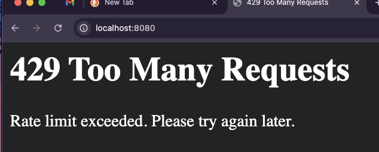
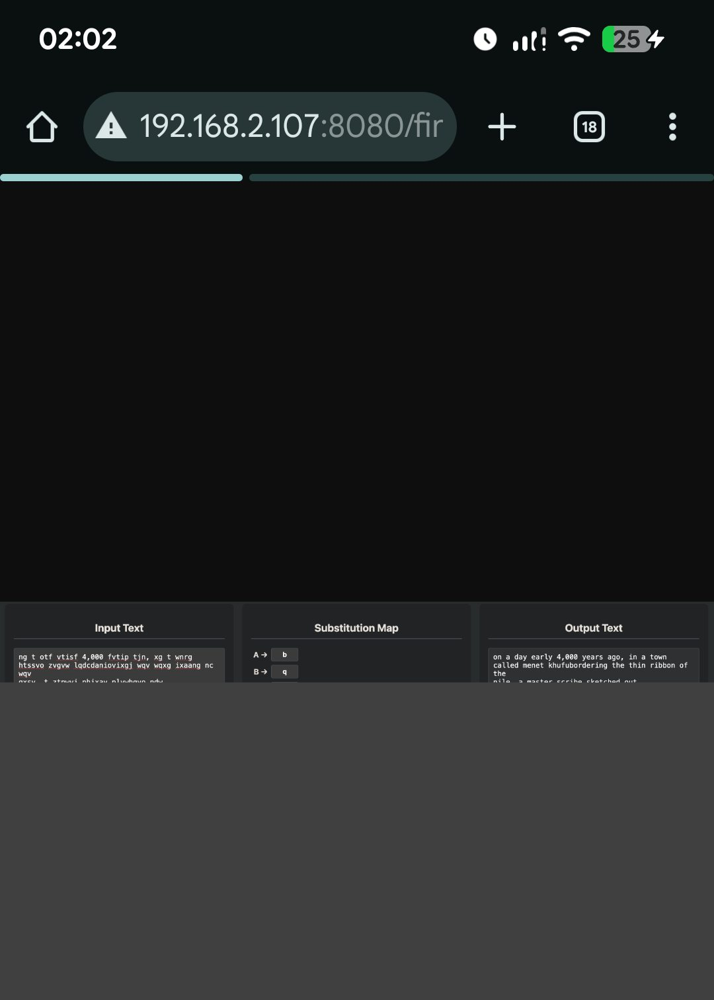
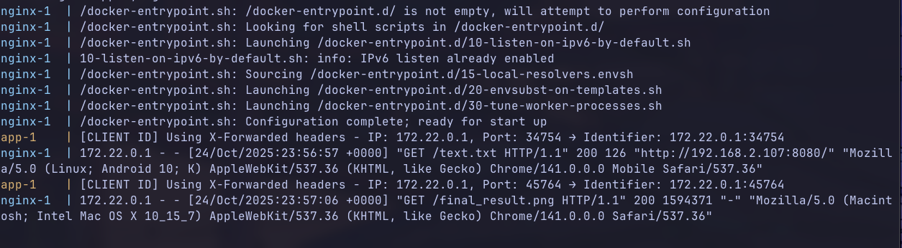

# Lab 2: HTTP file server with TCP sockets

## Task

In this lab, you will make your HTTP server multithreaded, so 
that it can handle multiple connections concurrently. You can 
either create a thread per request, or use a thread pool.
To test it, write a script that makes multiple concurrent requests 
to your server. Add a delay to the request handler to simulate work 
(~1s), make 10 concurrent requests and measure the amount of time in 
which they are handled. Do the same with the single-threaded server 
from the previous lab. Compare the two.

## Installation guide

```bash
git clone https://github.com/DdimaPos/network-programming
cd Lab2/
docker-compose up 

# for local testing
python3 serverMultithread.py content/
```

## 1. Perf comparison between server types

[test_concurent.py](test_concurent.py) file will send 10 requests for a file and log out the time from request to the moment of response.
Both servers have a delay of 1 second to simulate workflow.

So first of all I run the first server, then run the `test_concurent.py`
```bash
python3 server.py content/ 8080
python3 test_concurrent.py localhost 8080 "text.txt" 10
```

Then run the second server, run the `test_concurent.py`
```bash
python3 serverMultithread.py content/ 8080
python3 test_concurrent.py localhost 8080 "text.txt" 10
```

And below are the results

### Old implementation. Sigle threaded

Even if not all 10 requests were successfully processed, it can be clearly seen that all the requests were processed sequentially. One at a time

```
======================================================================
Testing 10 concurrent requests to http://localhost:8080/text.txt
======================================================================

Request  1: 1.014s - ✓
Request  2: 2.020s - ✓
Request  3: 3.028s - ✓
Request  4: 4.034s - ✓
Request  5: 5.041s - ✓
Request  6: 6.875s - ✓
Error requesting text.txt: [Errno 60] Operation timed out
Error requesting text.txt: [Errno 60] Operation timed out
Error requesting text.txt: [Errno 60] Operation timed out
Error requesting text.txt: [Errno 60] Operation timed out
Request  7: 7.787s - ✗
Request  8: 7.787s - ✗
Request  9: 7.788s - ✗
Request 10: 7.789s - ✗

----------------------------------------------------------------------
STATISTICS:
----------------------------------------------------------------------
Successful requests: 6/10
Total time (wall-clock): 7.792s
Average request time: 5.316s
Min request time: 1.014s
Max request time: 7.789s
Throughput: 1.28 requests/second
----------------------------------------------------------------------
```

### New implementation. Multiple threads

New implementation creates a new thread for each request which allows
to process them concurently (implementation did not involve creating 
physical threads so they are not processed in parallel)

```
======================================================================
Testing 10 concurrent requests to http://localhost:8080/text.txt
======================================================================

Request  1: 1.025s - ✓
Request  2: 1.025s - ✓
Request  3: 1.026s - ✓
Request  4: 1.026s - ✓
Request  5: 1.025s - ✓
Request  6: 1.038s - ✓
Request  7: 1.039s - ✓
Request  8: 1.038s - ✓
Request  9: 1.039s - ✓
Request 10: 1.039s - ✓

----------------------------------------------------------------------
STATISTICS:
----------------------------------------------------------------------
Successful requests: 10/10
Total time (wall-clock): 1.041s
Average request time: 1.032s
Min request time: 1.025s
Max request time: 1.039s
Throughput: 9.61 requests/second
----------------------------------------------------------------------
```

### Hit Counter and the race condition

Hit counter is a variable that stores a dictionary of paths and the number of visits it got. 
This variable is shared between all the users and is initialized at each start up of the server.

When user is requesting a path, then the counter is completed by the following lines:

```python
## did not write it in one line to enforce later race condition easier
old_value = request_counts.get(str(requested_path), 0)
request_counts[str(requested_path)] = old_value + 1
```

### Trigerring the race condition

A race condition occurs when different threads try to modify the same variable at the same time. Since modifying it envolves:

1. Loading the variable value in memory
2. Changing the value itself
3. Assigning the new value to the variable

With wrong timing on the step 1 all the threads will read the same value of the variable, will modify it and load back without 
knowing that other changes occured.

To trigger a race condition I introduced the following line:

```python
old_value = request_counts.get(str(requested_path), 0)
time.sleep(0.001) - # triggers switching contexts
request_counts[str(requested_path)] = old_value + 1
```

and in this case 0.001s of timeout between reading and assigning the new value (during this timeout it will switch to another thread) 
is just enough to see that race condition will occur. For example with the same test script 
requesting text.txt file 10 times, counter shows that it managed to 


### Fix of race condition

If remove the timeout, then the counter is looking well, BUT this only happens because the program is limited in it's capacity and it is a 
trivial operation. If there will be a scenario that some additional computations will require more time/thousands of threads the race condition will occur.

```python
counts_lock = threading.Lock()
"""Some code, some code...."""
            with counts_lock:
                request_counts[str(requested_path)] += 1

```

Solution to that is locking the counter variable. Locking means that access to that variable will be restricted to other threads until the current one ended the read/write operation on it. In this case there will be no scenarios when multiple threads read/write at the same time a variable value. This will create a queue for them only in accessing the variable, but will not influence the further operation made by the threads


### Spamming requests

I vibe-coded (choosed the dark path) a script that makes requests at a specific rate. 
Run it with this command:

```bash
# Send 100 requests at 15 req/sec with 15 worker threads 
# (more worker threads do not mean more requests. rate stays at 10)
python test_rate_limit.py localhost 8080 '' 100 15.0 15
``` 

Limit is 5 requests in second, so a with 15req/s rate only a third of 
the requests should have 200 status. This can be seen in the log

```
===
Testing 100 rate-limited requests to http://localhost:8080/
Rate: 15.00 requests/second
Workers: 15
===================================================================
===

Request 25: 01:40:31.391 - took 0.003s, status: ERROR - ✗
Request 88: 01:40:35.819 - took 0.001s, status: ERROR - ✗
Request 56: 01:40:33.562 - took 0.004s, status: ERROR - ✗
Request 24: 01:40:31.319 - took 0.003s, status: ERROR - ✗
Request 87: 01:40:35.749 - took 0.003s, status: ERROR - ✗
Request 55: 01:40:33.493 - took 0.005s, status: ERROR - ✗
Request 23: 01:40:31.252 - took 0.008s, status: ERROR - ✗
Request 86: 01:40:35.679 - took 0.002s, status: ERROR - ✗
Request  3: 01:40:30.830 - took 1.006s, status: 200 - ✓
Request 54: 01:40:33.420 - took 0.003s, status: ERROR - ✗
Request 85: 01:40:35.606 - took 0.002s, status: ERROR - ✗
Request  9: 01:40:30.262 - took 0.003s, status: ERROR - ✗
Request 53: 01:40:33.350 - took 0.002s, status: ERROR - ✗
Request 84: 01:40:35.535 - took 0.002s, status: ERROR - ✗
Request 52: 01:40:33.281 - took 0.004s, status: ERROR - ✗
Request 83: 01:40:35.465 - took 0.005s, status: ERROR - ✗
Request 51: 01:40:33.211 - took 0.004s, status: ERROR - ✗
Request 82: 01:40:35.394 - took 0.005s, status: ERROR - ✗
Request  5: 01:40:30.983 - took 1.010s, status: 200 - ✓
Request  2: 01:40:30.760 - took 1.007s, status: 200 - ✓
Request 50: 01:40:34.142 - took 1.007s, status: 200 - ✓
Request 19: 01:40:31.969 - took 1.006s, status: 200 - ✓
Request 81: 01:40:35.320 - took 0.002s, status: ERROR - ✗
Request 49: 01:40:34.068 - took 1.004s, status: 200 - ✓
Request 18: 01:40:30.896 - took 0.002s, status: ERROR - ✗
Request 21: 01:40:31.104 - took 0.002s, status: ERROR - ✗
Request 80: 01:40:36.251 - took 1.005s, status: 200 - ✓
Request 48: 01:40:32.993 - took 0.001s, status: ERROR - ✗
Request 79: 01:40:36.184 - took 1.010s, status: 200 - ✓
Request 20: 01:40:32.039 - took 1.007s, status: 200 - ✓
Request 15: 01:40:31.691 - took 1.008s, status: 200 - ✓
Request 47: 01:40:33.925 - took 1.005s, status: 200 - ✓
Request 22: 01:40:31.176 - took 0.002s, status: ERROR - ✗
Request  4: 01:40:30.910 - took 1.008s, status: 200 - ✓
Request 78: 01:40:35.106 - took 0.002s, status: ERROR - ✗
Request 46: 01:40:33.852 - took 1.003s, status: 200 - ✓
Request 77: 01:40:36.039 - took 1.006s, status: 200 - ✓
Request 45: 01:40:33.784 - took 1.007s, status: 200 - ✓
Request 76: 01:40:35.974 - took 1.011s, status: 200 - ✓
Request 44: 01:40:32.707 - took 0.002s, status: ERROR - ✗
Request 75: 01:40:35.900 - took 1.008s, status: 200 - ✓
Request 43: 01:40:32.645 - took 0.007s, status: ERROR - ✗
Request 74: 01:40:34.828 - took 0.006s, status: ERROR - ✗
Request  6: 01:40:30.054 - took 0.009s, status: ERROR - ✗
Request 42: 01:40:32.572 - took 0.001s, status: ERROR - ✗
Request 73: 01:40:34.754 - took 0.004s, status: ERROR - ✗
Request 41: 01:40:32.500 - took 0.001s, status: ERROR - ✗
Request 72: 01:40:34.681 - took 0.003s, status: ERROR - ✗
Request 40: 01:40:32.429 - took 0.002s, status: ERROR - ✗
Request 71: 01:40:34.611 - took 0.002s, status: ERROR - ✗
Request 39: 01:40:32.362 - took 0.002s, status: ERROR - ✗
Request 70: 01:40:34.538 - took 0.001s, status: ERROR - ✗
Request 38: 01:40:32.293 - took 0.003s, status: ERROR - ✗
Request 12: 01:40:30.471 - took 0.002s, status: ERROR - ✗
Request 69: 01:40:34.472 - took 0.006s, status: ERROR - ✗
Request 37: 01:40:32.225 - took 0.003s, status: ERROR - ✗
Request 68: 01:40:34.401 - took 0.004s, status: ERROR - ✗
Request 17: 01:40:31.834 - took 1.011s, status: 200 - ✓
Request 36: 01:40:32.157 - took 0.002s, status: ERROR - ✗
Request 11: 01:40:30.403 - took 0.003s, status: ERROR - ✗
Request 99: 01:40:36.601 - took 0.003s, status: ERROR - ✗
Request 67: 01:40:34.327 - took 0.002s, status: ERROR - ✗
Request 35: 01:40:33.091 - took 1.008s, status: 200 - ✓
Request 16: 01:40:31.763 - took 1.011s, status: 200 - ✓
Request 98: 01:40:36.525 - took 0.003s, status: ERROR - ✗
Request 66: 01:40:34.259 - took 0.001s, status: ERROR - ✗
Request 14: 01:40:30.619 - took 0.008s, status: ERROR - ✗
Request 34: 01:40:33.018 - took 1.003s, status: 200 - ✓
Request 97: 01:40:36.452 - took 0.002s, status: ERROR - ✗
Request 65: 01:40:35.190 - took 1.002s, status: 200 - ✓
Request 13: 01:40:30.543 - took 0.003s, status: ERROR - ✗
Request 33: 01:40:31.945 - took 0.001s, status: ERROR - ✗
Request 96: 01:40:36.380 - took 0.002s, status: ERROR - ✗
Request 64: 01:40:35.125 - took 1.006s, status: 200 - ✓
Request 32: 01:40:32.882 - took 1.007s, status: 200 - ✓
Request 63: 01:40:34.053 - took 0.004s, status: ERROR - ✗
Request 31: 01:40:32.811 - took 1.005s, status: 200 - ✓
Request  8: 01:40:30.193 - took 0.004s, status: ERROR - ✗
Request 62: 01:40:34.984 - took 1.007s, status: 200 - ✓
Request 30: 01:40:32.742 - took 1.007s, status: 200 - ✓
Request 93: 01:40:36.176 - took 0.004s, status: ERROR - ✗
Request 61: 01:40:34.911 - took 1.006s, status: 200 - ✓
Request  1: 01:40:30.695 - took 1.012s, status: 200 - ✓
Request 29: 01:40:31.672 - took 0.005s, status: ERROR - ✗
Request 60: 01:40:34.845 - took 1.007s, status: 200 - ✓
Request 10: 01:40:30.333 - took 0.003s, status: ERROR - ✗
Request 28: 01:40:31.601 - took 0.002s, status: ERROR - ✗
Request 59: 01:40:33.768 - took 0.001s, status: ERROR - ✗
Request 27: 01:40:31.528 - took 0.002s, status: ERROR - ✗
Request 58: 01:40:33.700 - took 0.001s, status: ERROR - ✗
Request  7: 01:40:30.120 - took 0.003s, status: ERROR - ✗
Request 26: 01:40:31.462 - took 0.003s, status: ERROR - ✗
Request 57: 01:40:33.631 - took 0.001s, status: ERROR - ✗
Request 89: 01:40:35.890 - took 0.002s, status: ERROR - ✗
Request 100: 01:40:36.674 - took 0.005s, status: ERROR - ✗
Request 90: 01:40:36.972 - took 1.012s, status: 200 - ✓
Request 91: 01:40:37.047 - took 1.016s, status: 200 - ✓
Request 92: 01:40:37.109 - took 1.007s, status: 200 - ✓
Request 94: 01:40:37.253 - took 1.011s, status: 200 - ✓
Request 95: 01:40:37.318 - took 1.006s, status: 200 - ✓

-------------------------------------------------------------------
---
STATISTICS:
-------------------------------------------------------------------
---
Successful requests: 35/100
Total time (wall-clock): 7.636s
Average request time: 0.355s
Min request time: 0.001s
Max request time: 1.016s
Actual throughput: 13.10 requests/second
Intended rate: 15.00 requests/second
-------------------------------------------------------------------
```

### IP awareness

This feature cannot be tested when running the docker container due to container network isolation.

From the logs I can all the requests appear to come from the Docker bridge gateway IP which in my case is
172.22.0.1

A good solution to this is to use a header like x-forwarded-for that will hold the actual IP of the 
user. Unfortunately I didn't though about this in advance, so I will will try to manage this in morning before presentation.

When trying to do this when running the script locally (in parallel I spamming messages at 40req/second rate), 
on another device data was successfully retrieved, but at slower speed.





### Update

After setting up nginx that will play a role of proxy, that will add set the X-Forwarded-For
differently for each IP that tries to connect. In this case each TCP connection is correctly identified
and the IP address will forwarded to program

Simple workflow is Phone -> Laptop -> Docker -> NGINX (read - x-forwarded-for) -> Program and backwards (from my understanding)


